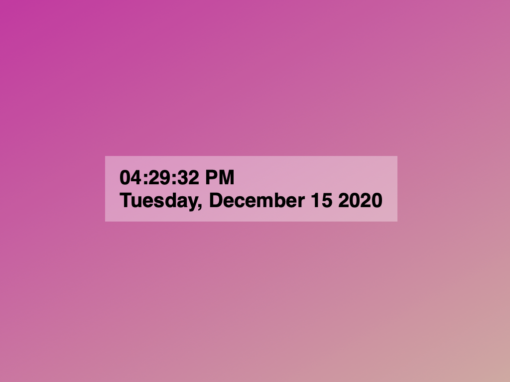

## Javascript Digital Time & Date

A simple digital clock app written entirely in Javascript, HTML and CSS

View it [here](https://ghilger16.github.io/GH--Digital-Clock/)

#### Summary

After a couple of programming classes under my belt I felt that I had reached
a point where I needed to start applying my knowledge to a functional project.  Although 
it may be simple, this project taught me some coding principals that had to be
experienced first hand.  

#### Author

Greg Hilger - Full Stack Software Developer
